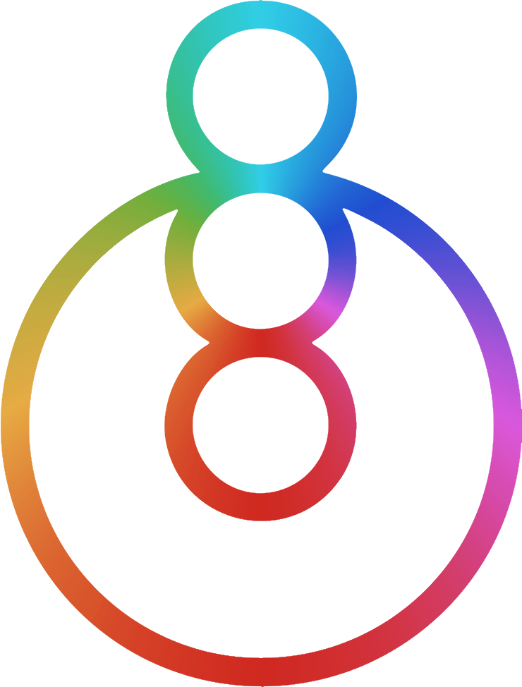

<div align="center">
  
  <h1 align="center">Skee</h1>
</div>

<p align="center">  
  🌟 if you're happy and you know it, leave a star 🌟
</p>

<!-- ### Table of contents -->

# Motivation

Extraordinary schema migration experience

```ts
abstract addTable: (action: bus.ducks.addTable.Action) => Promise<boolean>;
abstract dropTable: (action: string) => Promise<boolean>;
abstract addColumn: (action: bus.ducks.addColumn.Action) => Promise<boolean>;
abstract oneToOne: (action: bus.ducks.oneToOne.Action, schema: bus.Schema) => Promise<boolean>;
abstract oneToMany: (action: bus.ducks.oneToMany.Action, schema: bus.Schema) => Promise<boolean>;
abstract manyToMany: (action: bus.ducks.manyToMany.Action, schema: bus.Schema) => Promise<boolean>;
abstract commit: (action: bus.ducks.commit.Action) => Promise<boolean>;
abstract initialize: () => Promise<boolean>;
abstract getCommits: () => Promise<{ name: string; created_at: Date }[]>;
abstract beginTransaction: () => Promise<void>;
abstract commitTransaction: () => Promise<void>;
abstract rollbackTransaction: () => Promise<void>;
```
